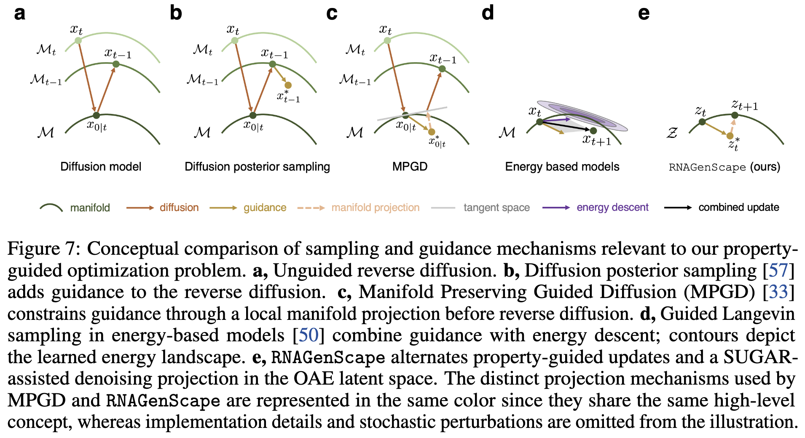

<div align="center">

  <h1><code>RNAGenScape</code></h1>

  [](https://arxiv.org/abs/2510.24736)
  [](https://arxiv.org/pdf/2510.24736)
  [](https://github.com/KrishnaswamyLab/RNAGenScape)
  <br>[](https://www.linkedin.com/in/danqi-liao-4852aba9/)
  [](https://www.linkedin.com/in/chenliu1996/)
  [](https://www.linkedin.com/in/xingzhi-sun)
  <br>[](https://scholar.google.com/citations?user=3rDjnykAAAAJ&sortby=pubdate)
  [](https://scholar.google.com/citations?user=tUvfTd8AAAAJ)
  <br>[](https://x.com/DanqiLiao73090)
  [](https://x.com/ChenLiu_1996)
  [](https://x.com/XingzhiSun)
  [](https://x.com/KrishnaswamyLab)

</div>

This is the official repository for the NeurIPS 2026 paper
<br>[RNAGenScape: property-guided, optimized generation of mRNA sequences with manifold Langevin dynamics](https://arxiv.org/pdf/2510.24736).

Please raise issues [here](https://github.com/ChenLiu-1996/RNAGenScape).

<br>

### Why would we emphasize "on-manifold"?


<br>

### Overview of the method


<br>

### Conceptual comparison



<br>

## Environment

Requires [uv](https://docs.astral.sh/uv/) and Python >= 3.12.

```bash
cd /path/to/RNAGenScape

# Create / sync the virtualenv from the lockfile
uv sync --python 3.12

# Activate
source .venv/bin/activate
```

### Cluster note (Misha / PyG)

`torch-scatter` is built from source on clusters with older glibc. Load a newer GCC **only while building**, then unload it before running Python (leaving GCC loaded can break the torch_scatter ABI):

```bash
module load GCC/12.2.0 CUDA/12.2.2
UV_HTTP_TIMEOUT=600 CXX=$(which g++) CC=$(which gcc) uv sync --python 3.12
module unload GCC
```


## Pretrained UTR-LM weights

Oracle training for `UTRLM` starts from the official pre-trained checkpoint (not domain-specific fine-tuned versions). Download:

```bash
mkdir -p checkpoints/utrlm
curl -L -o checkpoints/utrlm/utrlm_pretrained_siss_ep93.pkl \
  "https://raw.githubusercontent.com/a96123155/UTR-LM/main/Model/Pretrained/ESM2SISS_FS4.1_fiveSpeciesCao_6layers_16heads_128embedsize_4096batchToks_lr1e-05_supervisedweight1.0_structureweight1.0_MLMLossMin_epoch93.pkl"
```

Source: [a96123155/UTR-LM](https://github.com/a96123155/UTR-LM/tree/main/Model/Pretrained).


## RhoFold (optional folding confidence)

pLDDT evaluation uses the public [ml4bio/RhoFold](https://github.com/ml4bio/RhoFold) code and [Hugging Face weights](https://huggingface.co/cuhkaih/rhofold). Nothing under lab-private GPFS is required.

```bash
# One-time setup (clones into external_src/, downloads checkpoint, installs Bio/etc.)
bash bash/setup_rhofold.sh
# If RhoFold code and weights are already installed, only sync dependencies:
# uv sync --extra rhofold

# Or let eval auto-download the checkpoint once the source tree exists:
# Requires saved generations for the specified experiment.
python src/evaluation/eval_rhofold.py --dataset OpenVaccine --model DiffAb --experiment pos_guided
```

Defaults:

- Code: `external_src/RhoFold`
- Weights: `external_src/RhoFold_pretrained/RhoFold_pretrained.pt`

Override with `RHOFOLD_DIR` / `RHOFOLD_CKPT` or `--rhofold_dir` / `--ckpt` if you already have a local install.


## Data

Dataset loaders read the following paths relative to `data/`:

| Dataset | Input file(s) | Sequence / label columns | Sequence length |
|---|---|---|---:|
| OpenVaccine | `OpenVaccine/train.csv` | `sequence` / `reactivity_mean` | 107 |
| Zebrafish (proprietary; not included) | `Zebrafish/MPRA_mean_translation_2hpf_pa_Fish5UTR.csv` | `sequence` / `translation` | 124 |
| RibosomeLoading | `RibosomeLoading/MRL_Random50Nuc_SynthesisLibrary_Sample/4.10_train_data_GSM3130438_egfp_pseudo_2.csv` and `4.10_test_data_GSM3130438_egfp_pseudo_2.csv` in the same directory | `utr` / `rl` | 50 |

OpenVaccine and the RibosomeLoading train/test files are tracked. The large RibosomeLoading training CSV uses Git LFS; install Git LFS and retrieve the data after cloning:

```bash
git lfs install
git lfs pull
```

The Zebrafish CSV must be supplied separately at the path above. `data/` is ignored for additional untracked files; this does not exclude data files already tracked by Git.

OpenVaccine and Zebrafish use seeded 80% / 10% / 10% train/validation/test splits. RibosomeLoading uses the predefined train/test files (260,000 / 20,000 rows), with 15% of the training file reserved for validation. Label normalization is fitted on training labels and applied to validation and test labels.


## Experiments


<br>

The workflow for each dataset is:

1. **Oracle.** Train or load a separate property predictor. Use validation for checkpoint selection and the held-out test set for evaluation. For RNAGenScape, this oracle evaluates generated sequences; the OAE's own property head guides generation.
2. **Train the OAE.** Optimize the training split jointly for property prediction and sequence reconstruction. Validation selects the checkpoint and controls early stopping; it is not used for gradient updates.
3. **Prepare the manifold projector.** Encode training sequences with the trained OAE. Optionally augment these latents with SUGAR (`sugar_w > 0`; default is off). Train a DAE projector, or cache the reference latents for a kNN projector. kNN has no trainable parameters but still requires this preparation step.
4. **Generate.** Encode unseen test sequences, run property-guided Langevin updates in latent space, apply the selected projector after every step when projection is enabled, and decode the final latents to sequences.
5. **Evaluate.** Score start and generated sequences with the oracle held fixed during evaluation. Report property changes, Hamming distances, novelty, held-out distances, and optional folding confidence.

The default OAE is a deterministic residual convolutional autoencoder with 16 positional pooling bins and a 128-dimensional continuous latent vector. It has a sequence decoder and a property regression head, both operating on the same latent vector. Training minimizes `reg_w * MSE + recon_w * CE`, with defaults `reg_w=1` and `recon_w=5`. Checkpoint selection maximizes `0.5 * (val_pearson + val_spearman) + val_token_acc`.

SUGAR augments the latent reference set for projector preparation; it does not train the OAE. Reconstruction is measured using both token accuracy and exact-sequence accuracy.


## Citation

If you use RNAGenScape, please cite the paper:

```
@inproceedings{liao2026rnagenscape,
  title={RNAGenScape: Property-Guided, Optimized Generation of mRNA Sequences with Manifold Langevin Dynamics},
  author={Liao, Danqi and Liu, Chen and Sun, Xingzhi and Tang, Di{\'e} and Wang, Haochen and Youlten, Scott and Gopinath, Srikar Krishna and Lee, Haejeong and Strayer, Ethan C and Giraldez, Antonio J and others},
  booktitle={Advances in neural information processing systems},
  year={2026},
}
```
